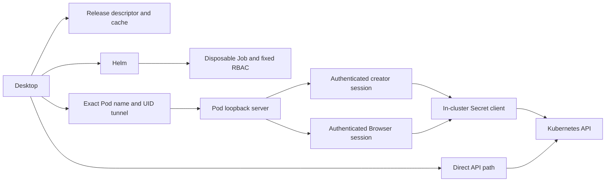

# Kubikles Accelerator architecture

Kubikles Accelerator is described below as Accelerator. The desktop owns one optional disposable workload per demand epoch and begins on the Direct path.

## Boundaries and data flow

The listener inside the Pod is `127.0.0.1:8080`. The desktop opens an OS-assigned local `127.0.0.1` port and tunnels it to the exact observed Pod name and UID. The tunnel is not a Service or general-purpose proxy.

## Request flows

- Integrated list, detail, and watch calls cross the authenticated creator session, fixed policy, projection boundary, and in-cluster Secret client. Lists and watches are value-free. Detail returns values only for the explicitly requested Secret.
- Direct handles every mutation, every non-Secret read, and any call whose policy, capability, session, or transport check fails. It remains authoritative.
- Browser receives a dedicated Secret-only artifact. A one-time ticket in a `#ticket=` fragment lasts 60 seconds and is cleared before network activity, imports, or output. The resulting bearer stays in memory; no persistent cookie is created.

## Compatibility and replacement

The release resolver/cache selects an immutable descriptor. Provisioning creates one exact Job; connection authenticates one exact Pod tunnel. Literal nonempty `BuildVersion` mismatch causes disposal, fresh descriptor resolution, and at most one replacement. A repeated mismatch disposes the replacement, creates no third workload, and latches Direct for the current desktop session or continuous-demand epoch. Generation fencing rejects stale connection and callback state.

## Session and workload lifecycle

Resume reuses only the same workload and authenticated creator session while it remains valid. Browser handoff transfers workload ownership from the creator to the authenticated Browser session. Browser HTTP sessions have a 15-minute idle limit and an 8-hour hard lifetime.

When the authenticated client count reaches zero, an exact two-minute grace begins. Reconnection during that grace cancels expiry. Expiry clears Browser, creator-session, and watcher state, then the process exits naturally. The Job has a 30-second termination grace and `ttlSecondsAfterFinished: 3600`.

Accelerator never deletes itself. Kubernetes TTL removes only a completed Job and its Pod; normal desktop disposal uses Helm uninstall to remove the five release objects. On desktop crash, TTL cannot act until the process completes. A later desktop startup may sweep only a release proven both owned and inert; ambiguous or active resources are left alone and Direct stays available.

[Back to the Accelerator overview](../features/accelerator.md)
