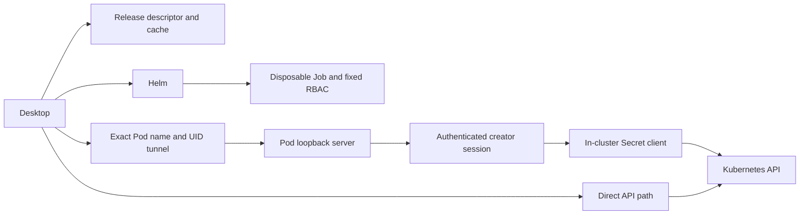

# Kubikles Accelerator architecture

Kubikles Accelerator is described below as Accelerator. The selected desktop connection owns one optional disposable workload when explicitly enabled and begins on the Direct path. Secret demand can lease an enabled session but never starts, retries, or removes a deployment; an enabled workload remains alive when demand returns to zero.

## Boundaries and data flow

The listener inside the Pod is `127.0.0.1:8080`. The desktop opens an OS-assigned local `127.0.0.1` port and tunnels it to the exact observed Pod name and UID. The tunnel is not a Service or general-purpose proxy.

## Request flows

- Integrated list, detail, and watch calls cross the authenticated creator session, fixed policy, projection boundary, and in-cluster Secret client. Lists and watches are value-free. Detail returns values only for the explicitly requested Secret.
- Direct handles every mutation, every non-Secret read, and any call whose policy, capability, session, or transport check fails. It remains authoritative.

## Compatibility and replacement

The release resolver/cache selects an immutable descriptor. Provisioning creates one exact Job; connection authenticates one exact Pod tunnel. Literal nonempty `BuildVersion` mismatch causes disposal, fresh descriptor resolution, and at most one replacement by default. Settings can explicitly select a development release version and HTTPS descriptor; the separately marked Warn and continue policy relaxes only the runtime version comparison while retaining authentication, capability, ownership, and Direct-fallback checks. A repeated mismatch under the default policy disposes the replacement, creates no third workload, and latches Direct for the current desktop session or continuous-demand epoch. Generation fencing rejects stale connection and callback state.

## Session and workload lifecycle

Resume reuses only the same workload and authenticated creator session while it remains valid.

Disable & Remove synchronously revokes Integrated routing, then uses exact owned disposal. Context switching and shutdown use the same fencing first. Activation failures make the enabled connection unavailable after bounded transient attempts; only the explicit Retry control starts a new activation epoch. The Job has a 30-second termination grace and `ttlSecondsAfterFinished: 3600`.

Accelerator never deletes itself. Kubernetes TTL removes only a completed Job and its Pod; normal desktop disposal uses Helm uninstall to remove the five release objects. On desktop crash, TTL cannot act until the process completes. A later desktop startup may sweep only a release proven both owned and inert; ambiguous or active resources are left alone and Direct stays available.

[Back to the Accelerator overview](../features/accelerator.md)
