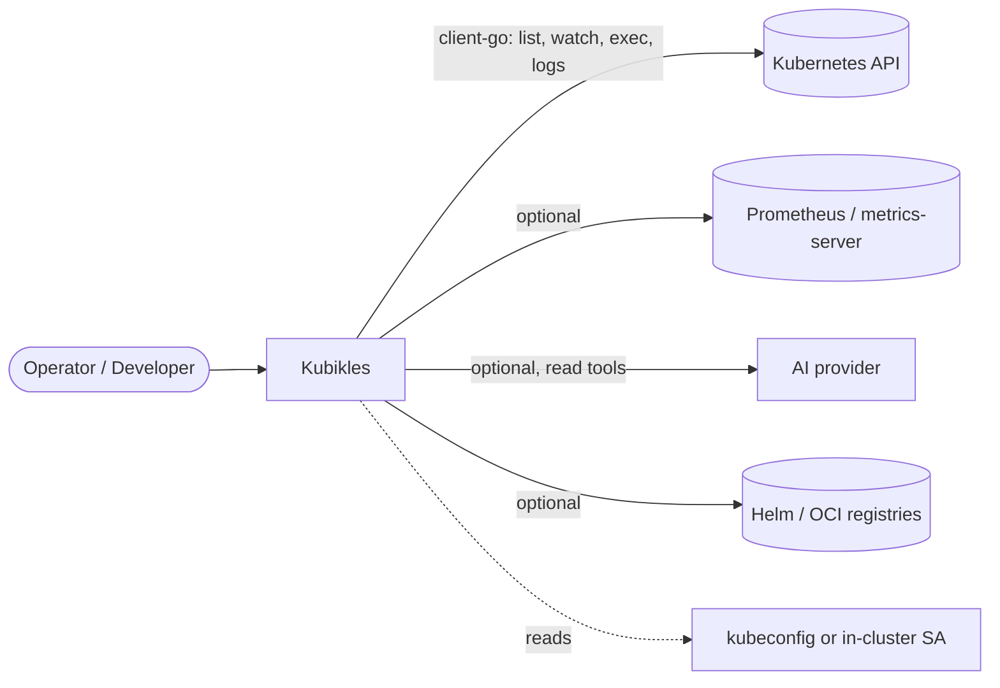

<!-- solution-docs:begin architecture -->
# Architecture

Kubikles is a Go backend and a React frontend joined by the [Wails](https://wails.io/)
framework. The backend owns all Kubernetes interaction; the frontend is a pure
view layer that calls backend methods and reacts to events. The same backend core
drives three different frontends (a native desktop window, a browser over HTTP, or
no UI at all) without knowing which one it is talking to.

> For the authoritative, file-by-file layout of the codebase, see the
> [AI Reference](ai/README.md). This document covers the high-level shape and
> deliberately does not duplicate the file index.

## Context



## Components

```mermaid
flowchart TB
    subgraph frontend[React Frontend]
        views[Feature views + shared components]
        ctx[Context providers - state]
    end
    subgraph backend[Go Backend]
        app[App - composition root]
        k8s[k8s: client-go wrapper, watch, diff, deps, metrics]
        detect[issuedetector: rule engine]
        aimgr[ai / mcp / tools: assistant + tool registry]
        term[terminal: PTY / conpty sessions]
        helm[helm: releases, repos, OCI]
    end
    emitter{{events.Emitter}}
    transport[Wails IPC  |  HTTP+WebSocket  |  headless]

    views --> transport
    transport --> app
    app --> k8s & detect & aimgr & term & helm
    app --> emitter --> transport --> ctx
    ctx --> views
```

- **App (composition root)** — a single `App` struct wires everything together.
  Its Kubernetes-facing methods are split by domain into many `app_*.go` files so
  no one file owns every operation. These methods are what the frontend calls.
- **k8s package** — the `client-go` wrapper: per-context clientsets, resource
  CRUD, watching, YAML diffing, dependency-graph resolution, and metrics
  (metrics-server and Prometheus). The heart of the backend.
- **issuedetector** — a rule engine that scans cached cluster state and emits
  findings. Rules are built-in Go plus user-supplied YAML.
- **ai / mcp / tools** — the AI assistant, an MCP server, and the allowlisted tool
  registry that lets the assistant read the cluster safely.
- **terminal** — platform-specific interactive session lifecycle (PTY on Unix,
  conpty on Windows).
- **helm** — release, repository, and OCI operations, compiled only into the full
  build.

## Run modes and the emitter

The same `App` core runs in three modes, chosen at startup:

- **Desktop** — a native Wails window; calls and events cross the native IPC bridge.
- **Server** — an HTTP + WebSocket server serving the embedded frontend to any
  browser, including from inside a cluster. See [Server Mode](server-mode.md).
- **Headless** — no UI; used for programmatic and MCP access.

The backend never hard-codes which of these it is in. All real-time updates flow
through an `events.Emitter` abstraction, so domain code emits an event without
knowing whether it lands on Wails IPC or a WebSocket. This is the single seam that
makes one codebase serve three deployment shapes.

## How data flows

1. **Initial load** — a view calls a backend method; the backend queries the API
   and returns the result.
2. **Live updates** — a backend watcher observes a change and emits a (batched)
   event; the matching context provider updates and the view re-renders.
3. **Actions** — a view calls a backend method (edit, delete, scale, forward…);
   the backend performs the API operation and returns the outcome.

## Why this shape

Three decisions define the architecture, each in service of *small and fast*:

- **Bindings are code-generated, not reflected.** Backend methods are dispatched
  through generated code rather than runtime reflection, which keeps dead-code
  elimination effective and the binary small.
- **Watch events are coalesced.** Rapid updates are batched into short windows and
  deduplicated before crossing to the frontend, capping IPC/WebSocket overhead on
  busy clusters; deletions flush immediately for correctness.
- **Watchers are reference-counted.** A resource watcher starts on its first
  subscriber and stops shortly after the last one leaves, so the client only pays
  for what is on screen.

For the rationale behind these and other trade-offs, see [Decisions](decisions.md).

_Generated by solution-docs against commit `b504296` on 2026-07-03._
<!-- solution-docs:end architecture -->
